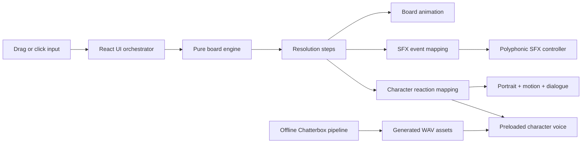

<p align="center">
  
</p>

<h1 align="center">Sweet Mayhem</h1>

<p align="center">
  A dark, gothic and slightly sarcastic match-3 game built as an interactive frontend.
</p>

## About the game

**Sweet Mayhem** takes the familiar match-3 formula and drops it into a neon gothic arcade. The player swaps cursed candies on an 8×8 board, creates combinations, triggers cascades and earns score multipliers while a reactive character comments.

The experience begins before the board appears. A three-step arcade introduction uses the player's first interaction to unlock browser audio, then presents the title and finally starts the game. From there, music, sound effects, speech bubbles, synthesized voice lines and character animation react (pun intended) to the state of each move.

This started as a gameplay exercise, but evolved into a broader experiment in frontend architecture, deterministic game logic, audiovisual orchestration and locally generated character voice.

## What you can do

- Swap candies by dragging them or by selecting two neighboring tiles.
- Receive immediate feedback for invalid and non-adjacent swaps.
- Match rows or columns of three or more candies.
- Trigger multiple match groups in the same resolution step.
- Build cascades as candies fall and the board refills.
- Create striped candies with matches of four and color bombs with matches of five or more.
- Earn progressively larger scores during cascades.
- Hear a sequential three-track soundtrack with a persistent mute preference.
- Get distinct sound, dialogue, voice and animation feedback for matches of 3, 4, 5, 6+, rejected swaps and cascades.
- Restart with a fresh board that contains no pre-existing matches.

## Technical highlights

| Area | Implementation |
| --- | --- |
| UI | React 19 with functional components, Hooks and small focused controllers |
| Build tooling | Vite 8 with the official React plugin |
| Game engine | Framework-independent JavaScript modules with immutable board transformations |
| Styling | Responsive CSS, custom properties, keyframe animation, layered fog and inline SVG bats |
| Audio | Browser `Audio`/`HTMLAudioElement` APIs, preloading, independent volume policies and polyphonic SFX pools |
| Character system | Event-to-reaction catalogs connecting animation, dialogue and generated voice assets |
| Voice generation | Reproducible offline Chatterbox Nano pipeline with manifest-driven acting parameters |
| Quality | Node's built-in test runner, ESLint and production build validation |

No external state-management or animation library is used. React owns presentation state, while the rules of the board live in pure JavaScript functions that can be tested without rendering a component.

## Architecture

The game is organized around explicit domain events rather than direct coupling between every visual and audio component.



The board engine returns a sequence of semantic steps such as `match-found`, `tiles-cleared`, `tiles-fell` and `tiles-refilled`. The interface uses those steps to coordinate animation timing. Separate adapters translate the same match data into sound identities and character reactions.

This keeps concerns isolated: changing a sound file does not change match detection, and changing a character line does not change scoring.

### Game logic

The core engine in `app/src/game` handles:

- board creation without opening matches;
- adjacency validation without row-boundary errors;
- immutable swapping, clearing, falling and refilling;
- horizontal and vertical match-group detection;
- special-candy planning;
- multi-stage cascade resolution;
- cascade-aware scoring;
- injectable randomness for deterministic tests;
- a maximum-cascade safety limit for pathological random sources.

The UI receives new arrays instead of mutating the existing board. Besides fitting React's state model, this makes individual transformations easier to reason about and test.

### Audio design

The audio layer is split into three independent systems:

1. **Background music** — a catalog-backed playlist that advances when a track ends and returns to the first track only after the full list finishes.
2. **Candy sound effects** — event-specific effects with per-sound volume and polyphony settings. Player pools allow distinct match groups to sound at the same time without constantly constructing new audio objects.
3. **Character voice** — preloaded voice assets selected from the same reaction identity used by the speech bubble and portrait animation.

Music and game effects have separate volume policies. The mute preference applies to background music and is persisted in `localStorage`; gameplay effects remain independent.

## Chatterbox voice integration

Character dialogue was generated locally with [Resemble AI's Chatterbox](https://github.com/resemble-ai/chatterbox), using the CPU-oriented `ResembleAI/chatterbox-nano` model.

This is a build-time asset pipeline, not a runtime web service:

- `tools/chatterbox/voice_manifest.json` defines dialogue, acting direction, emotion tags, seeds and sampling controls.
- `tools/chatterbox/generate_voice_assets.py` validates the manifest and renders selected or complete voice sets.
- Generated PCM WAV files are copied into `app/src/audio/voice`.
- `generation-report.json` records the model, source, duration, sample rate and SHA-256 hash of every generated line.
- The React application only preloads and plays the finished files, so gameplay has no model-loading delay and requires no AI service or network connection.

The current assets use Chatterbox's built-in model voice. No external speaker recording or cloned performer was used. Drag-start dialogue intentionally remains text-only because it fires frequently and spoken feedback became repetitive during playtests.

Full regeneration instructions are available in [`tools/chatterbox/README.md`](tools/chatterbox/README.md).

## Testing strategy

The automated suite currently contains **56 passing tests**. It focuses on behavior that is easy to break in a match-3 engine:

- row and column matching;
- swaps across row boundaries;
- rejected and accepted moves;
- board collapse and refill;
- deterministic cascades and safety limits;
- special-candy creation and priority;
- score and resolution-step ordering;
- SFX mappings for simple, simultaneous and cascading matches;
- reaction, dialogue and voice catalog integrity;
- playlist ordering and wraparound.

Catalogs and their entries are frozen with `Object.freeze`, making accidental runtime configuration changes less likely.

## Running locally

### Requirements

- Node.js
- npm

### Install and start

```bash
cd app
npm install
npm run dev
```

Vite will print the local development URL in the terminal.

### Quality checks

```bash
cd app
npm test
npm run lint
npm run build
```

The production output is generated in `app/dist`.

Python and the Chatterbox dependencies are optional. They are only required when regenerating character voices; they are not required to run or build the game.

## Project structure

```text
sweet-mayhem/
├── app/
│   ├── public/                      # Favicon and browser-served assets
│   ├── src/
│   │   ├── audio/                   # Music, SFX, voices, catalogs and provenance
│   │   ├── character/               # Reaction, dialogue and voice-selection rules
│   │   ├── components/              # Audio controllers, character and background
│   │   ├── fonts/                   # Local arcade and gothic typefaces + licenses
│   │   ├── game/                    # Pure board and candy domain logic + tests
│   │   ├── images/                  # Active board, character and background artwork
│   │   ├── App.jsx                  # UI state and game-flow orchestration
│   │   ├── index.css                # Responsive gothic arcade presentation
│   │   └── main.jsx                 # React application entry point
│   ├── eslint.config.js             # JavaScript and React linting rules
│   ├── package.json                 # App dependencies and development commands
│   └── vite.config.js               # Vite and React build configuration
├── tools/
│   └── chatterbox/
│       ├── reference/               # Guidance for authorized voice references
│       ├── generate_voice_assets.py # Manifest validation and WAV generation
│       ├── requirements.txt         # Pinned Chatterbox installation
│       └── voice_manifest.json      # Dialogue and generation parameters
├── .gitignore                       # Generated dependencies, builds and caches
└── README.md                        # Main project documentation
```

## Accessibility and interaction

- Every candy tile is a native button with a descriptive accessible label.
- The board can be played with click selection as an alternative to drag and drop.
- Character dialogue is exposed through an `aria-live` region.
- Busy and transition states are communicated with ARIA attributes.
- Focus-visible styles are included for the main controls.
- Reduced-motion preferences disable the most prominent entrance animations.
- The board and presentation adapt to desktop and narrow mobile layouts.

## Audio and asset provenance

Source and license information is kept close to the assets and catalogs:

- Music metadata: [`app/src/audio/musicCatalog.js`](app/src/audio/musicCatalog.js)
- Sound-effect sources: [`app/src/audio/sfx/SOURCES.md`](app/src/audio/sfx/SOURCES.md)
- Generated-voice provenance: [`app/src/audio/voice/SOURCES.md`](app/src/audio/voice/SOURCES.md)

## Current scope and next steps

Sweet Mayhem is a polished frontend prototype, not a finished commercial release. Natural next steps include activating special-candy effects, adding explicit win or move-limit conditions, extracting the intro flow into a dedicated state-machine module, adding component-level interaction tests and optimizing the larger image/audio assets.

The current character is used as a temporary fan-project reference and is not original project IP. A commercial or publicly distributed production version should replace it with an original character or use properly licensed assets.

## Author

Developed by **Danilo Nascimento**.
